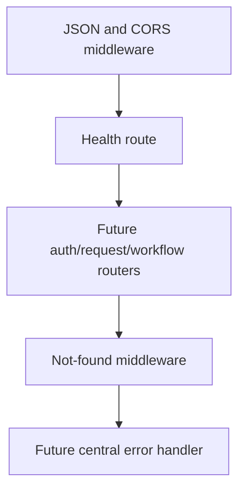

# Backend Task: Health Check and API Not-Found Response

## Objective

Keep the existing health endpoint working and implement a normalized `404` response for unknown API routes. Add Supertest coverage for both behaviors.

This task intentionally avoids authentication, request visibility, workflow, salary calculations, and storage.

## Owned Files

```text
backend/src/middleware/notFound.ts
backend/src/app.ts
backend/src/app.test.ts     create with the first tests
```

Do not edit routes, services, shared contracts, data fixtures, or the memory store.

## Environment Setup

Clone and open the repository:

```bash
git clone https://github.com/zorologist/Travel-Reimbursement-System.git
cd Travel-Reimbursement-System
npm install
code .
```

Create a branch:

```bash
git switch main
git pull
git switch -c backend/health-and-not-found
```

## Current Request Pipeline

The order must remain:



The not-found middleware must be registered after every valid route. Otherwise it intercepts valid requests.

## Required Response

Any unknown route must return status `404` and exactly this shape:

```json
{
  "error": {
    "code": "ROUTE_NOT_FOUND",
    "message": "The requested API route was not found.",
    "details": null
  }
}
```

## Implementation Guidance

In `backend/src/middleware/notFound.ts`, export an Express request handler. A suitable shape is:

```ts
import type { RequestHandler } from "express";

export const notFoundHandler: RequestHandler = (_request, response) => {
  response.status(404).json({
    error: {
      code: "ROUTE_NOT_FOUND",
      message: "The requested API route was not found.",
      details: null,
    },
  });
};
```

In `backend/src/app.ts`:

1. Import `notFoundHandler` using the Node ESM `.js` suffix.
2. Keep the current `/api/health` endpoint.
3. Register `app.use(notFoundHandler)` after the health endpoint.
4. Leave a clear location above it for future routers.

Expected order:

```ts
app.use(cors());
app.use(express.json());

app.get("/api/health", ...);

// Future auth/request/workflow routers go here.

app.use(notFoundHandler);
```

## Tests

Create `backend/src/app.test.ts` with Vitest and Supertest.

Required cases:

```text
GET /api/health
├── returns 200
└── returns { status: "ok" }

GET /api/route-that-does-not-exist
├── returns 404
├── content type is JSON
└── returns the normalized error object
```

Suggested test structure:

```ts
import request from "supertest";
import { describe, expect, it } from "vitest";

import { app } from "./app.js";

describe("application routes", () => {
  it("returns backend health", async () => {
    const response = await request(app).get("/api/health");

    expect(response.status).toBe(200);
    expect(response.body).toEqual({ status: "ok" });
  });

  it("returns normalized JSON for an unknown route", async () => {
    const response = await request(app).get("/api/route-that-does-not-exist");

    expect(response.status).toBe(404);
    expect(response.headers["content-type"]).toMatch(/json/);
    expect(response.body).toEqual({
      error: {
        code: "ROUTE_NOT_FOUND",
        message: "The requested API route was not found.",
        details: null,
      },
    });
  });
});
```

Tests import `app` rather than starting `server.ts`, so they do not open a real network port.

## Verification

From the repository root:

```bash
npm run test --workspace backend
npm run typecheck --workspace backend
npm run build --workspace backend
```

All commands must pass.

Optional manual check:

```bash
npm run dev --workspace backend
```

Then visit:

```text
http://localhost:3000/api/health
http://localhost:3000/api/does-not-exist
```

Stop the server with `Ctrl+C`.

## Git Submission

Review changes:

```bash
git status --short
git diff
```

Commit only the assigned files:

```bash
git add backend/src/middleware/notFound.ts backend/src/app.ts backend/src/app.test.ts
git commit -m "Add backend health and not-found tests"
git push -u origin backend/health-and-not-found
```

Pull-request title:

```text
Add backend health and not-found behavior
```

## Acceptance Checklist

- [ ] Existing health endpoint still returns `200`.
- [ ] Unknown routes return `404`.
- [ ] Unknown routes use the required JSON structure.
- [ ] Not-found middleware is registered after valid routes.
- [ ] Supertest does not start the real server.
- [ ] Backend tests pass.
- [ ] Backend type-check passes.
- [ ] Backend build passes.
- [ ] No unrelated files were changed.

## Integration Warning

Person 1 will later register authentication, request, workflow, and central error middleware. The final order must be:

```text
CORS → JSON → valid routes → not found → central error handler
```

If a future router is placed below `notFoundHandler`, every endpoint in that router will incorrectly return `404`.
