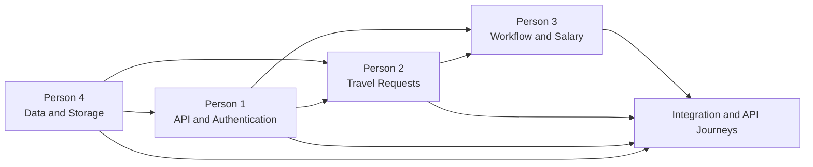
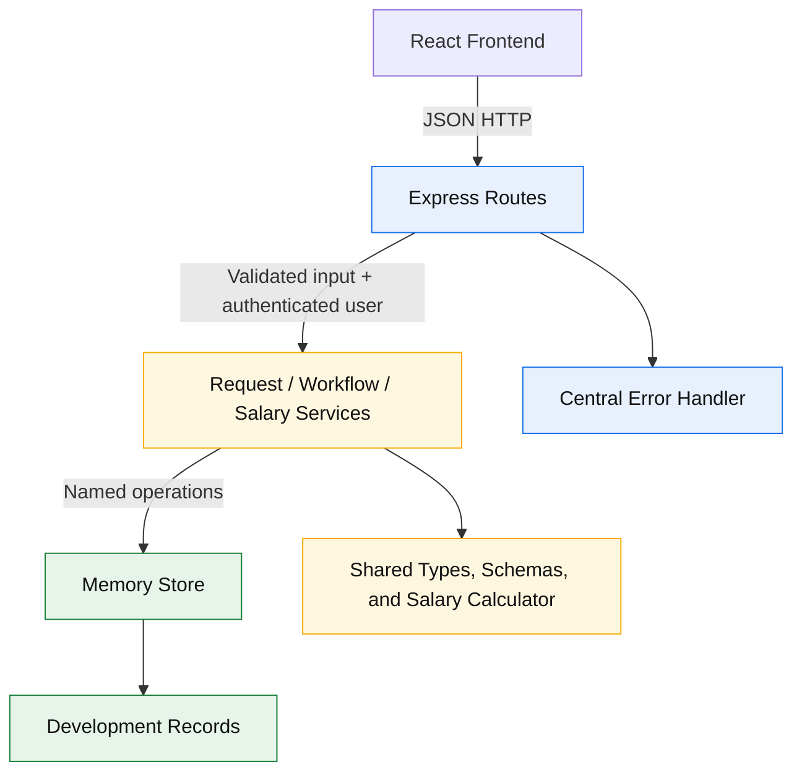
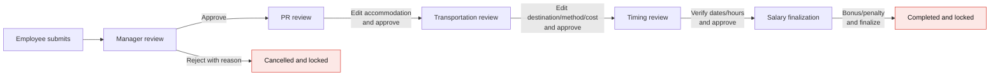
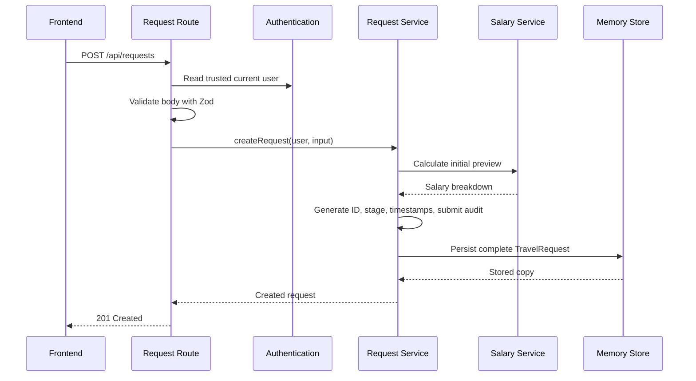
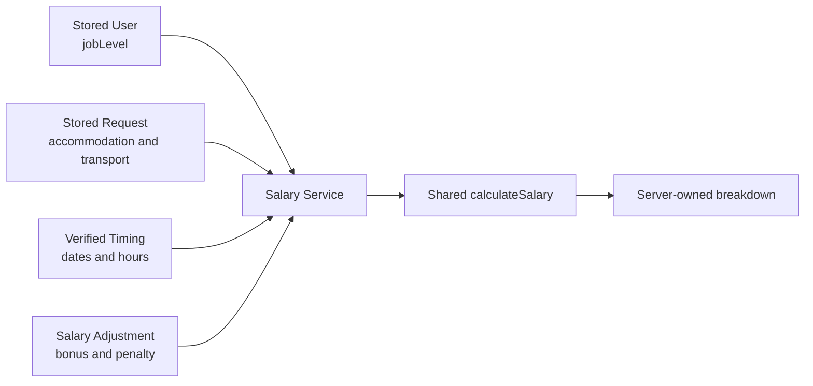
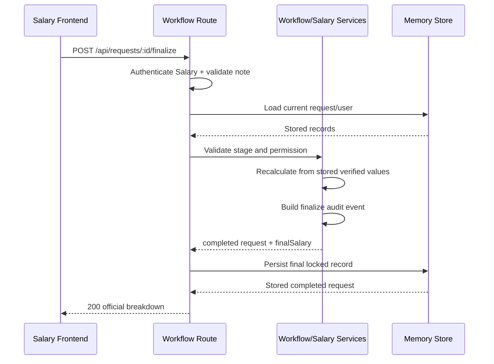
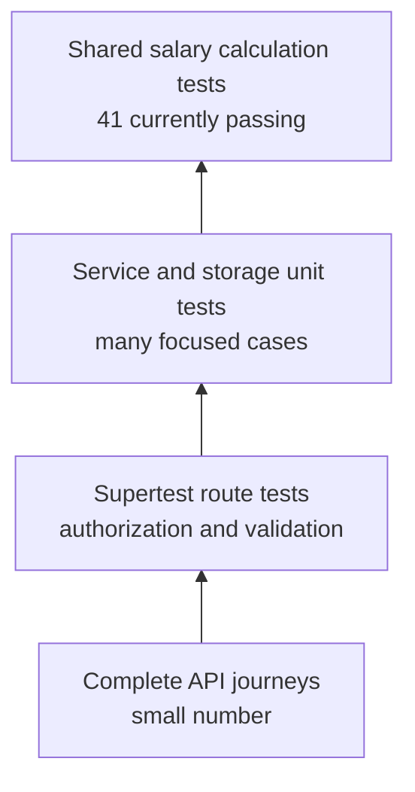

<!-- Backend audit and assignment plan based on the repository state on 2026-07-18. -->

# Backend Remaining Work and Team Assignment Plan

## Purpose

This document explains the current backend state, what is already implemented, what is incomplete or broken, which files each developer should own, and how the four backend assignments should be integrated.

Use this document to assign work. Use [BACKEND_TEAM_GUIDE.md](BACKEND_TEAM_GUIDE.md) for the original role descriptions and this document for the current recovery plan.

The audit is based on the repository state on **18 July 2026**. It describes the code that exists, not only the original README plans.

## Executive Summary

The backend is still an unconnected collection of partial pieces. The salary calculator is the strongest completed area. The workflow service and memory storage have received work but are not finished. Authentication, request endpoints, workflow endpoints, salary orchestration, error handling, and backend API tests are still missing.

Only this endpoint is currently registered:

```http
GET /api/health
```

The intended request lifecycle cannot currently be completed through HTTP.

### Current status at a glance

| Area | Status | Main evidence |
| --- | --- | --- |
| Express startup and health | Partial | Server starts in development; only health route is registered |
| Authentication | Missing | `authRoutes.ts` contains only a responsibility comment |
| Request creation/list/detail/edit | Missing | Request route and service files contain only comments |
| Workflow domain rules | Partial | Large pure service exists but has correctness and type issues |
| Workflow HTTP API | Missing | `workflowRoutes.ts` contains only a comment |
| Shared salary calculation | Mostly complete | 41 salary tests pass when run directly |
| Backend salary orchestration | Missing | `salaryService.ts` contains only a comment |
| In-memory storage | Broken partial implementation | Functions exist but do not type-check and are unsafe |
| Development data | Partial and internally inconsistent | Users and requests exist but seed calculations/audits are invalid |
| Central error handling | Missing | `errorHandler.ts` contains only a comment |
| Runtime validation | Contracts exist but are unused | Zod schemas are not called by routes |
| Backend tests | Missing | No backend test files exist |
| Backend build/type-check | Failing | TypeScript reports storage, workflow, and shared ESM errors |

### Original four-person split



Based on file contents and Git history, the two assignments with substantial backend work are:

- **Person 3:** shared salary rules and a partial workflow service.
- **Person 4:** development data and a partial memory store.

Person 1 and Person 2 remain mostly at scaffold level.

This is a status observation for planning, not a judgment about individual contributors.

## Intended Backend Architecture

The finished backend should follow this dependency direction:



### Boundary rules

- Routes translate HTTP and validate untrusted input.
- Routes do not implement business rules.
- Services enforce visibility, workflow, calculation, and permission rules.
- Services do not use Express request or response objects.
- Only storage code changes in-memory records.
- Shared salary calculation remains pure.
- Actor identity always comes from authentication, never from the browser body.
- The browser never chooses the official total, stage, or next workflow stage.

## Immediate Blockers

These issues should be fixed before judging later feature work.

### 1. Backend type-check fails

Current errors include:

- `new Data()` instead of `new Date()` in `memoryStore.ts`.
- `UpdatedAt` instead of the contract field `updatedAt`.
- An incorrectly inferred audit-event array type.
- Unsafe `any` parameters in storage.
- `NEXT_STAGE[request.stage]` indexing failure in `workflowService.ts`.
- Shared ESM imports missing `.js` extensions under backend `NodeNext` compilation.

Verification command:

```bash
npm run typecheck --workspace backend
```

### 2. Shared package wiring is inconsistent

The backend compiles `../shared` directly while the shared code is configured with bundler module resolution. This produces ESM import errors.

Recommended long-term solution:

1. Add `shared` to the root npm workspaces.
2. Add a single shared export entry point.
3. Import shared contracts through the package name rather than `../../../shared/...`.
4. Make shared build, test, and type-check part of root commands.

An acceptable short-term solution is to make every shared ESM relative import NodeNext-compatible, but the team should avoid maintaining two incompatible import strategies.

### 3. Storage contracts are not stable

Person 1, Person 2, and Person 3 depend on storage. Agree on these signatures first:

```ts
findUserById(id: string): User | undefined;
findUserByEmployeeNumber(employeeNumber: string): User | undefined;
listUsers(): User[];

findRequestById(id: string): TravelRequest | undefined;
listRequests(): TravelRequest[];
createRequest(request: TravelRequest): TravelRequest;
updateRequest(id: string, updates: Partial<TravelRequest>): TravelRequest | null;
resetStore(): void;
```

Returned records must not allow callers to silently mutate internal storage.

## Workflow Being Implemented



No request may skip a stage or move backward in version one. Only Manager may reject. Completed and cancelled requests are read-only.

## Person 1 — API Setup and Authentication

### Owned files

```text
backend/src/app.ts
backend/src/server.ts
backend/src/routes/authRoutes.ts
backend/src/middleware/errorHandler.ts
backend/src/middleware/authenticate.ts         new
backend/src/types/express.d.ts                 optional new
backend/package.json
backend/tsconfig.json
```

### Current state

| Item | State |
| --- | --- |
| Express application | Present |
| JSON parser | Present |
| CORS | Present, currently unrestricted |
| Health endpoint | Present |
| Router registration | Missing |
| Development login | Missing |
| Current-user restoration | Missing |
| Authentication middleware | Missing |
| Logout | Missing/undecided |
| Error normalization | Missing |
| API 404 response | Missing |
| Tests | Missing |

### Assignable tasks

#### P1.1 — Stabilize application composition

- Register the authentication router under `/api/auth`.
- Register the request router under `/api/requests`.
- Register workflow routes at their agreed request paths.
- Add a JSON 404 handler after registered routes.
- Add the central error handler last.
- Keep process startup in `server.ts`, not `app.ts`, so Supertest can import the app without opening a port.

Target composition:

```text
CORS
  ↓
JSON parser
  ↓
Public health/auth routes
  ↓
Authentication middleware for protected routes
  ↓
Request/workflow routes
  ↓
404 handler
  ↓
Central error handler
```

#### P1.2 — Implement development authentication

Required endpoints:

| Method | Path | Access | Result |
| --- | --- | --- | --- |
| `POST` | `/api/auth/login` | Public | Establish development identity |
| `GET` | `/api/auth/me` | Signed in | Return trusted current user |
| `POST` | `/api/auth/logout` | Signed in | Clear identity if required by the chosen method |

Requirements:

- Validate login input with Zod.
- Look up a development user through storage.
- Reject unknown credentials consistently.
- Attach a trusted `User` to protected requests.
- Never trust `actorId`, `employeeId`, or `actorRole` supplied by clients.
- Keep the mechanism easy to replace with Active Directory later.

The development mechanism can use a lightweight token or session. It must be documented and tested. Real company credentials must not be added.

#### P1.3 — Implement consistent errors

Recommended payload:

```json
{
  "error": {
    "code": "WORKFLOW_ACTION_NOT_ALLOWED",
    "message": "The current user cannot perform this action.",
    "details": null
  }
}
```

Suggested status mapping:

| Situation | Status |
| --- | ---: |
| Invalid body/query/parameter | `400` |
| Missing or invalid authentication | `401` |
| Signed in but not permitted | `403` |
| Request/user not found | `404` |
| Invalid or stale workflow transition | `409` |
| Unexpected server error | `500` |

Do not expose stack traces or raw internal exceptions.

#### P1.4 — Add tests

Minimum tests:

- Health returns `200` and `{ "status": "ok" }`.
- Valid development login succeeds.
- Invalid login fails.
- `/api/auth/me` returns the signed-in user.
- Missing authentication returns `401`.
- Unknown API path returns normalized `404`.
- Unexpected error returns safe `500` JSON.

### Person 1 completion gate

- Every development user can establish identity.
- Protected endpoints receive a trusted current user.
- All routers are registered.
- Errors use one JSON shape.
- Authentication tests pass.
- Backend type-check does not fail in Person 1 files.

## Person 2 — Travel Request Lifecycle

### Owned files

```text
backend/src/routes/requestRoutes.ts
backend/src/services/requestService.ts
shared/types/TravelRequest.ts
shared/schemas/TravelRequestSchema.ts
```

### Current state

| Item | State |
| --- | --- |
| Shared `TravelRequest` type | Present |
| Create-input type | Present but minimal |
| Request Zod schema | Present but validation is weak |
| Request route | Missing |
| Request service | Missing |
| Creation | Missing |
| List/visibility | Missing |
| Details | Missing |
| Employee correction | Missing |
| Request API tests | Missing |

### Required endpoints

| Method | Path | Purpose |
| --- | --- | --- |
| `GET` | `/api/requests` | List requests visible to the current user |
| `POST` | `/api/requests` | Submit the current user's personal request |
| `GET` | `/api/requests/:id` | Return one visible request with audit/calculation |
| `PATCH` | `/api/requests/:id` | Correct employee-owned fields while editable |

### Assignable tasks

#### P2.1 — Strengthen input contracts

Creation must accept only fields the employee controls:

```ts
interface CreateTravelRequestInput {
  destinationCity: string;
  departureAt: string;
  returnAt: string;
  accommodationType: AccommodationType;
  transportationMethod: string;
}
```

The browser must not set:

- Request ID
- Employee ID
- Stage
- Verified dates or hours
- Transportation cost unless the contract later explicitly allows supporting evidence
- Bonus or penalty
- Salary preview or final salary
- Cancellation reason
- Timestamps
- Audit events

Strengthen Zod rules:

- Trim strings.
- Reject empty destination/method.
- Require valid ISO datetimes.
- Require departure before return.
- Require submission before departure.
- Reject unknown keys or explicitly strip them according to the agreed API policy.

#### P2.2 — Implement request creation

Creation sequence:



The initial stage is `manager-review`. Creation must include a `submit` audit event.

#### P2.3 — Implement visibility

Recommended version-one rules:

- Every authenticated staff member can list their own requests.
- Manager sees requests at `manager-review`.
- PR sees requests at `pr-review`.
- Transportation sees requests at `transportation-review`.
- Timing sees requests at `timing-review`.
- Salary sees requests at `salary-finalization`.
- Completed/cancelled history visibility must follow an explicit policy.
- A user with multiple capabilities receives the union of permitted records without duplicates.

The backend performs filtering. Query parameters may narrow an already-authorized result but never broaden it.

#### P2.4 — Implement details and correction

- Return `404` when a request ID does not exist.
- Return `403` when it exists but is outside the current user's visibility.
- Include calculation and audit history in details.
- Employee corrections apply only to the owner's request and permitted fields.
- Reuse workflow edit rules rather than duplicating the 30-minute rule in routes.
- Validate new dates before saving.
- Recalculate when a correction affects salary preview.
- Add an append-only edit audit event.

#### P2.5 — Add tests

Minimum tests:

- Valid creation returns `201`.
- Backend controls ID, owner, stage, timestamps, preview, and audit.
- Empty/invalid fields return `400`.
- Return before departure fails.
- Past departure fails.
- Browser-controlled stage/total is ignored or rejected.
- Employee sees their own requests only.
- Department reviewer sees the correct stage queue.
- Missing request returns `404`.
- Unauthorized details return `403`.
- Permitted correction succeeds and audits.
- Expired or prohibited correction fails.

### Person 2 completion gate

- Any authenticated staff member can create a personal request.
- List results obey visibility rules.
- Details and corrections are authorized and validated.
- Creation/correction produce audit events.
- Request API tests pass.

## Person 3 — Workflow and Salary Rules

### Owned files

```text
backend/src/routes/workflowRoutes.ts
backend/src/services/workflowService.ts
backend/src/services/salaryService.ts
shared/types/Workflow.ts
shared/constants/salaryRates.ts
shared/salary/calculateSalary.ts
shared/salary/calculateSalary.test.ts
docs/WORKFLOW.md
docs/SALARY_RULES.md
```

### Current state

| Item | State |
| --- | --- |
| Pure salary calculator | Implemented |
| Salary boundary tests | 41 passing when run directly |
| Workflow permission functions | Partially implemented |
| Workflow transitions | Partially implemented |
| Audit-event construction | Implemented in pure service |
| Workflow correctness tests | Missing |
| Salary orchestration service | Missing |
| Workflow route | Missing |
| Persistence integration | Missing |
| Recalculation integration | Missing |
| Final salary save/lock | Missing |

### Required endpoints

| Method | Path | Current stage/role | Result |
| --- | --- | --- | --- |
| `PATCH` | `/api/requests/:id/review` | Current department | Save allowed edits and recalculate |
| `POST` | `/api/requests/:id/approve` | Manager/PR/Transportation/Timing | Move exactly one stage |
| `POST` | `/api/requests/:id/reject` | Manager review/Manager | Cancel with reason |
| `POST` | `/api/requests/:id/finalize` | Salary finalization/Salary | Calculate, save, complete, lock |

Salary should not require a redundant approve-then-finalize sequence unless the product owner explicitly adds such a requirement.

### Assignable tasks

#### P3.1 — Repair workflow domain logic

Fix the current TypeScript indexing error and the following rule gaps:

| Problem | Required correction |
| --- | --- |
| Transportation cannot edit `destinationCity` | Add it to transportation-owned fields |
| Salary can edit `finalSalary` directly | Remove it from editable fields |
| Rejection does not set `cancellationReason` | Require/store the reason and audit note |
| Empty edit creates audit noise | Reject or return unchanged without an event |
| Date edits are not validated | Validate ISO values and ordering |
| Salary can approve in place | Remove unless separately confirmed |
| Finalization changes only stage | Calculate and store final breakdown first |
| Self-finalization is unchecked | Apply the product owner's separation-of-duties decision |

The pure workflow service may return updated request values, but persistence remains the store's responsibility.

#### P3.2 — Implement salary orchestration

`salaryService.ts` must transform trusted stored data into `SalaryCalculationInput`.



The service must determine:

- Official daily rate from the stored user's job level.
- Overnight count from trusted/verified dates.
- Whether the mission is same-day or overnight.
- Same-day verified hours.
- Return-day verified hours.
- Stored accommodation type.
- Stored transportation cost.
- Stored bonus and penalty.

It must never accept the daily rate, calculation components, or total from the browser.

Recalculate after:

- Initial request creation.
- Employee correction affecting dates/accommodation.
- PR accommodation edit.
- Transportation destination/method/cost edit.
- Timing date/hour verification.
- Salary bonus/penalty adjustment.

#### P3.3 — Implement workflow route integration

For every action:

1. Read the authenticated user.
2. Validate route parameters and body.
3. Load the request.
4. Confirm visibility.
5. Confirm the request is not terminal.
6. Confirm role and current stage.
7. Validate only department-owned fields.
8. Apply domain transition/edit.
9. Recalculate when affected.
10. Persist once through storage.
11. Return the stored request.

Do not accept a desired next stage from the browser.

#### P3.4 — Finalization transaction



The final request must contain:

- `stage: "completed"`
- A non-null `finalSalary`
- The official complete calculation breakdown
- A finalization audit event
- Updated timestamp

#### P3.5 — Add tests

Minimum service/API coverage:

- Every valid approval transition.
- Every out-of-order approval.
- Wrong-role action.
- Manager-only rejection with reason.
- No later-stage rejection.
- Department-owned field restrictions.
- PR/Transportation/Timing recalculation.
- Exactly seven verified hours qualifies.
- Below seven hours does not qualify.
- Bonus/penalty recalculation.
- Browser-provided total is ignored/rejected.
- Finalization stores a complete breakdown.
- Completed/cancelled requests are locked.
- Optional self-finalization prohibition.

### Person 3 completion gate

- Workflow order and roles are enforced.
- Every material action creates one correct audit event.
- Every calculation uses trusted stored information.
- Finalization saves `finalSalary` and locks the request.
- Workflow and salary API tests pass.

## Person 4 — Development Data, Storage, and Audit Persistence

### Owned files

```text
backend/src/data/company.ts
backend/src/data/users.ts
backend/src/data/requests.ts
backend/src/storage/memoryStore.ts
shared/types/User.ts
docs/DEVELOPMENT_DATA.md
```

### Current state

| Item | State |
| --- | --- |
| Users for all roles | Present |
| Example requests | Present but invalid/inconsistent |
| User lookup | Partial |
| Request lookup/list | Partial |
| Request creation | Unsafe and incorrectly typed |
| Request update | Broken |
| Audit append | Broken typing and mutation safety |
| Immutable copies | Missing |
| Reset support | Missing |
| Storage tests | Missing |

### Assignable tasks

#### P4.1 — Repair types and names

Current concrete defects:

- Rename `updareRequest` to `updateRequest`.
- Replace `new Data()` with `new Date()`.
- Replace `UpdatedAt` with `updatedAt`.
- Type request parameters with `TravelRequest`/`Partial<TravelRequest>`.
- Type events with `AuditEvent`.
- Type `developmentRequests` as `TravelRequest[]`.
- Type seed stages as `WorkflowStage`.
- Remove unused or incorrect imports.
- Correct `departements` to `departments`.

#### P4.2 — Prevent silent mutation

This is unsafe:

```ts
return [...developmentRequests];
```

It copies only the array. A caller can still mutate a returned request or its `auditEvents` array.

Return isolated records. `structuredClone` is acceptable for these development objects, or implement deliberate copy functions. Apply the same rule to create, find, list, and update results.

#### P4.3 — Protect storage invariants

- Do not allow an update to replace `id` or `employeeId` accidentally.
- Do not allow ordinary updates to erase audit history.
- Audit events are append-only.
- Not-found updates return a documented result.
- Store timestamps use ISO 8601.
- Avoid separate update and audit calls that can leave a half-updated record. Prefer persisting one service-produced complete record or a clearly atomic storage operation.

#### P4.4 — Add deterministic reset support

Tests must start from known data:

```ts
beforeEach(() => {
  resetStore();
});
```

Reset must create fresh records, not reuse already-mutated nested arrays.

#### P4.5 — Correct development data

Current seed problems:

- Seed daily rates `500`, `450`, `600`, and `550` do not match documented job levels.
- Seed requests use `room-and-food` but calculate overnight amounts at 100%, not 50%.
- The completed request has `finalSalary: null`.
- Later-stage requests have no transition audit events.
- Some request owners/roles do not demonstrate realistic personal request behavior.
- Seed dates and stages are not strongly typed.
- Company policy text is incomplete.

Every seed record should pass `TravelRequestSchema` and be internally consistent.

Recommended examples:

| Record | Purpose |
| --- | --- |
| Manager-review request | Employee submission with submit audit |
| PR-review request | Submit + Manager approval audits |
| Transportation-review request | Adds PR edit/approval history |
| Timing-review request | Adds Transportation verification history |
| Salary-finalization request | Contains verified timing and accurate preview |
| Completed request | Has final salary and full audit chain |
| Cancelled request | Has Manager rejection reason and terminal audit |

#### P4.6 — Add storage tests

- Lookup success and not found.
- Create returns and stores an isolated copy.
- List results cannot mutate storage.
- Update changes permitted values and timestamp.
- Audit append preserves previous events.
- Reset restores exact fresh fixtures.
- All seed users/requests pass shared schemas.

### Person 4 completion gate

- Storage type-checks without `any`.
- Returned objects cannot silently modify stored records.
- Reset is deterministic.
- Seed data passes schemas and calculations.
- Storage tests pass.

## Administrator Self-Service Decision

Every administrator, including Salary, is also a company employee who may submit personal travel requests. The current code does not model this consistently:

- Development Salary user has `roles: ["salary"]`.
- Workflow submission currently requires role `employee`.

Choose one rule before implementation continues.

### Recommended rule

Personal request submission is a baseline capability for every authenticated staff account. Department roles grant additional review capability.

```text
Signed-in staff
└── May create and view their own requests

Manager/PR/Transportation/Timing/Salary role
└── Adds access to the matching department queue/actions
```

Alternative: add `employee` to every administrator's role array. This works but requires careful active-role selection and can complicate permission checks.

### Separation of duties

The project owner must decide whether a Salary employee can finalize their own request after it passes earlier departments.

Recommended financial control:

```ts
if (request.employeeId === currentUser.id) {
  throw new ForbiddenError("A Salary user cannot finalize their own request.");
}
```

If self-finalization is prohibited, add at least two Salary development users so one can finalize the other's request during testing.

## API Completion Matrix

| Method | Endpoint | Owner | State | Expected success |
| --- | --- | --- | --- | ---: |
| `GET` | `/api/health` | Person 1 | Present | `200` |
| `POST` | `/api/auth/login` | Person 1 | Missing | `200` |
| `GET` | `/api/auth/me` | Person 1 | Missing | `200` |
| `POST` | `/api/auth/logout` | Person 1 | Optional/undecided | `204` |
| `GET` | `/api/requests` | Person 2 | Missing | `200` |
| `POST` | `/api/requests` | Person 2 | Missing | `201` |
| `GET` | `/api/requests/:id` | Person 2 | Missing | `200` |
| `PATCH` | `/api/requests/:id` | Person 2 | Missing | `200` |
| `PATCH` | `/api/requests/:id/review` | Person 3 | Missing | `200` |
| `POST` | `/api/requests/:id/approve` | Person 3 | Missing | `200` |
| `POST` | `/api/requests/:id/reject` | Person 3 | Missing | `200` |
| `POST` | `/api/requests/:id/finalize` | Person 3 | Missing | `200` |

## Runtime Validation Plan

Shared Zod schemas exist but are not currently used by backend routes.

Recommended input schemas:

```text
LoginInputSchema
CreateTravelRequestInputSchema
EmployeeRequestEditSchema
DepartmentReviewEditSchema
ApproveRequestInputSchema
RejectRequestInputSchema
FinalizeRequestInputSchema
RequestIdParamSchema
RequestListQuerySchema
```

Validation responsibilities:

| Boundary | Validate |
| --- | --- |
| Route parameters | IDs and required format |
| Query string | Filters, stages, page sizes, dates |
| Request body | Allowed fields, types, ranges, ISO dates |
| Service | Cross-field and business rules |
| Storage fixtures | Complete stored-record schema |

Zod validation does not replace service authorization.

## Audit Trail Design

Every material action creates an append-only event:

| Action | Required audit information |
| --- | --- |
| Submit | Actor, creation stage, time, optional note |
| Employee edit | Before/after values |
| Manager approve | Manager review → PR review |
| Manager reject | Manager review → cancelled and reason |
| PR edit/approve | Accommodation changes and transition |
| Transportation edit/approve | Destination/method/cost and transition |
| Timing edit/approve | Verified date/hour changes and transition |
| Salary adjustment | Bonus/penalty before/after and reason |
| Finalize | Salary finalization → completed and final breakdown context |

An existing audit event must never be updated or deleted.

## Testing Plan

### Test pyramid



### Required backend test journeys

#### Journey A — Complete approval

```text
Employee submits
→ Manager approves
→ PR edits/approves
→ Transportation edits/approves
→ Timing verifies/approves
→ Salary adjusts/finalizes
→ Request is completed and locked
```

Verify stage, calculation, timestamp, actor, and audit history after every step.

#### Journey B — Manager cancellation

```text
Employee submits
→ Manager rejects with reason
→ Request is cancelled
→ Every later edit/approval/finalization fails
```

#### Journey C — Recalculation

```text
PR changes accommodation
→ preview changes
Transportation changes cost
→ preview changes
Timing verifies seven hours
→ return-day amount applies
Salary applies penalty
→ official preview changes
```

#### Journey D — Security

- Unauthenticated request returns `401`.
- Wrong role returns `403`.
- Wrong stage returns `409`.
- Browser-supplied actor is ignored.
- Browser-supplied next stage is ignored/rejected.
- Browser-supplied official total is ignored/rejected.
- Unauthorized request details are not exposed.
- Completed and cancelled records cannot change.

### Test file ownership

| Tests | Owner |
| --- | --- |
| App, health, authentication, errors | Person 1 |
| Request service/routes/visibility | Person 2 |
| Workflow, salary orchestration/routes | Person 3 |
| Storage and seed validation | Person 4 |
| Complete API journeys | Integration owner, with all four reviewing |

Remove reliance on `--passWithNoTests` as evidence of completion. Zero tests must not be reported as successful feature coverage.

## Integration Plan

### Phase 0 — Agree on decisions

Project owner confirms:

1. Development login mechanism.
2. Baseline personal-request capability for administrators.
3. Department queue visibility.
4. Required Manager rejection reason.
5. Save edits separately from approval, or combine them.
6. Salary self-finalization policy.
7. Completed/cancelled history visibility.

Recommended defaults:

- Lightweight development token/session.
- All authenticated staff may create personal requests.
- Reviewers see requests at their assigned stage.
- Manager rejection reason is required.
- Edits can be saved before approval.
- Salary cannot finalize their own request.
- Staff see their own history; departments see records relevant to their authorized work.

### Phase 1 — Foundation

- Person 4 repairs storage and seeds.
- Person 1 repairs shared import/build configuration.
- Agree on storage and authentication interfaces.

Exit condition:

```bash
npm run typecheck --workspace backend
```

passes, storage tests pass, and fixtures are valid.

### Phase 2 — Authentication and requests

- Person 1 implements authentication and errors.
- Person 2 implements creation/list/details/correction.

Exit condition: a signed-in staff member can submit and retrieve a personal request through Supertest.

### Phase 3 — Workflow and salary

- Person 3 repairs workflow rules.
- Person 3 implements salary orchestration and workflow endpoints.
- Person 4 supports any final atomic persistence interface.

Exit condition: every stage can be completed through API tests without skipping or trusting browser totals.

### Phase 4 — Integration and hardening

- Register all routers.
- Run complete journeys.
- Test simultaneous/stale actions.
- Confirm safe errors and visibility.
- Update documentation.

Exit condition: all backend definition-of-done items pass from the repository root.

## Branch and Merge Strategy

Suggested branches:

```text
backend/person1-auth-api
backend/person2-requests
backend/person3-workflow-salary
backend/person4-storage-data
backend/integration
```

Rules:

- Each person mainly edits their owned files.
- Shared contract changes require team notice before merging.
- Avoid formatting unrelated files in feature branches.
- Rebase/merge the repaired storage and shared configuration before integrating request/workflow routes.
- Every pull request includes relevant tests and verification output.
- Integration fixes go into the owning branch when practical rather than accumulating undocumented patches.

### Pull-request checklist

- [ ] Change stays within assigned ownership or explains cross-owner edits.
- [ ] No `any` is added without a documented reason.
- [ ] Untrusted input uses a runtime schema.
- [ ] Actor identity comes from authentication.
- [ ] Business rules remain in services.
- [ ] Storage is changed only through named storage operations.
- [ ] Errors use the common shape.
- [ ] Tests cover success, validation, authorization, and conflict behavior.
- [ ] Type-check passes.
- [ ] Tests pass.
- [ ] Production build passes.

## Verification Commands

From the repository root:

```bash
npm run typecheck --workspace backend
npm run test --workspace backend
npm run build --workspace backend
```

Shared salary tests currently require direct execution because `shared` is not included in the root workspace list:

```bash
cd shared
npm test
```

After workspace wiring is repaired, root commands should run frontend, backend, and shared verification consistently.

## Backend Definition of Done

The development backend is complete only when all of the following are true:

- [ ] Backend type-check and build pass.
- [ ] Shared package imports use one stable strategy.
- [ ] Every development user can establish identity.
- [ ] Actor ID and roles come only from backend authentication.
- [ ] Every authenticated staff member can submit a personal request.
- [ ] Request lists and details enforce visibility.
- [ ] Every input is runtime-validated.
- [ ] Requests move through the exact stage order.
- [ ] Only Manager can reject, with the agreed reason rule.
- [ ] Departments can edit only their owned fields.
- [ ] Salary uses stored and verified data for calculations.
- [ ] Recalculation occurs after every relevant edit.
- [ ] Finalization saves a complete official breakdown.
- [ ] Every material action produces an append-only audit event.
- [ ] Completed and cancelled requests are locked.
- [ ] Storage returns mutation-safe records and resets predictably.
- [ ] Seed data is valid and internally consistent.
- [ ] Unit, API, and complete-journey tests pass.
- [ ] Errors are consistent and do not expose internals.
- [ ] The frontend can complete the full employee-to-Salary journey using only documented APIs.

## Recommended Assignment Board

Copy these cards into the team's task tracker.

### Person 1 cards

- P1.1 Router registration and application composition
- P1.2 Development login and current-user middleware
- P1.3 Central errors and API 404
- P1.4 Authentication and application tests
- P1.5 Shared/backend module-resolution repair, coordinated with integration owner

### Person 2 cards

- P2.1 Request input schemas and validation
- P2.2 Request creation and initial audit/preview
- P2.3 Role-aware personal and department request listing
- P2.4 Request details and employee correction
- P2.5 Request service and Supertest coverage

### Person 3 cards

- P3.1 Workflow type and rule repairs
- P3.2 Salary input derivation and recalculation service
- P3.3 Review, approve, and reject endpoints
- P3.4 Salary adjustment and finalization endpoint
- P3.5 Workflow/salary service and API tests

### Person 4 cards

- P4.1 Strongly typed memory store repair
- P4.2 Mutation-safe copies and storage invariants
- P4.3 Deterministic reset support
- P4.4 Valid development fixtures with complete audit histories
- P4.5 Storage and seed-schema tests

### Integration-owner cards

- I.1 Confirm the seven product decisions
- I.2 Freeze shared service/storage/API interfaces
- I.3 Merge and register all routers
- I.4 Complete approval, cancellation, recalculation, and security journeys
- I.5 Root workspace/test/build cleanup
- I.6 Update README implementation status after verification

## Final Ownership Rule

The team should optimize for clear boundaries, not for the number of files changed:

```text
Person 1 owns identity and HTTP foundation.
Person 2 owns the request lifecycle and visibility.
Person 3 owns workflow permission and financial truth.
Person 4 owns reliable stored state and fixtures.
The integration owner owns proof that all four parts work together.
```

No feature is finished merely because its service function exists. It is finished when the authenticated route, validation, business rule, persistence, audit event, error behavior, and automated tests all work together.
