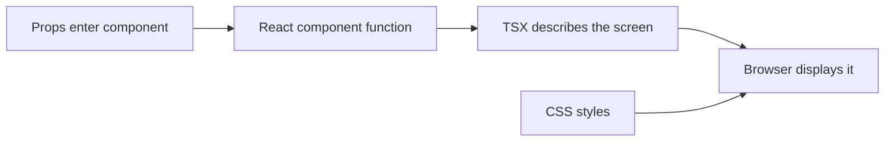
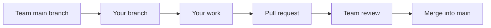

# Beginner Frontend Mini-Course: Loading, Empty, Error, Forbidden, and Not Found

This guide is written for someone new to programming. Follow it from top to bottom. Do not worry if the terms are unfamiliar at first.

## Your Assignment

You will build five small reusable user-interface pieces:

```text
LoadingState  → shown while information is loading
EmptyState    → shown when there is no information
ErrorState    → shown when something failed
ForbiddenPage → shown when the user lacks permission
NotFoundPage  → shown when a URL does not exist
```

You are not working on login, requests, salary calculations, APIs, or the dashboard.

## What Technology Are We Using?

| Technology | Meaning |
| --- | --- |
| VS Code | Program used to open and edit project files |
| Git | Tracks changes and lets teammates work separately |
| GitHub | Website where the project repository is stored |
| TypeScript | JavaScript with extra type checking |
| React | Library for building screens from components |
| TSX | TypeScript files that contain React/HTML-like markup |
| CSS | Controls colors, spacing, layout, and appearance |
| Vite | Starts and builds the frontend application |

### How a React component works



Example:

```tsx
interface GreetingProps {
  name: string;
}

export function Greeting({ name }: GreetingProps) {
  return <p>Hello, {name}!</p>;
}
```

- `interface` describes the information the component accepts.
- `name: string` means `name` must be text.
- `export function` makes the component available to other files.
- `{name}` places the value inside the displayed TSX.

## Part 1 — Install the Required Programs

Ask for help if Git, Node.js, or VS Code is already installed but does not open.

Install:

1. **Git:** <https://git-scm.com/downloads>
2. **Node.js LTS:** <https://nodejs.org/>
3. **Visual Studio Code:** <https://code.visualstudio.com/>

Recommended VS Code extensions:

- ESLint
- Prettier - Code formatter
- GitHub Pull Requests

Open a normal terminal and confirm:

```bash
git --version
node --version
npm --version
code --version
```

Each command should print a version number.

## Part 2 — Download the GitHub Project

### Easiest VS Code method

1. Open **Visual Studio Code**.
2. Press `Ctrl+Shift+P` on Windows/Linux or `Cmd+Shift+P` on macOS.
3. Type `Git: Clone`.
4. Select **Git: Clone**.
5. Paste:

```text
https://github.com/zorologist/Travel-Reimbursement-System.git
```

6. Choose a normal folder such as `Documents`.
7. Wait for the download.
8. Press **Open** when VS Code asks whether to open the repository.
9. If VS Code asks whether you trust the authors, confirm only if this is the expected team repository.

### Terminal method

```bash
cd Documents
git clone https://github.com/zorologist/Travel-Reimbursement-System.git
cd Travel-Reimbursement-System
code .
```

The final `.` means “open the current folder.”

## Part 3 — Open the VS Code Terminal

In VS Code:

1. Select **Terminal** in the top menu.
2. Select **New Terminal**.
3. A terminal appears at the bottom.
4. Make sure the prompt is inside `Travel-Reimbursement-System`.

Run:

```bash
npm install
```

Wait until it finishes. Do not close the terminal during installation.

## Part 4 — Create Your Own Git Branch

Never work directly on `main`.

Run these commands one at a time:

```bash
git switch main
git pull
git switch -c frontend/beginner-ui-states
```

Visual explanation:



Confirm your branch:

```bash
git branch --show-current
```

It should print:

```text
frontend/beginner-ui-states
```

## Part 5 — Understand the Project Explorer

On the left side of VS Code, click the top **Explorer** icon.

Open these folders by clicking the arrows:

```text
Travel-Reimbursement-System
└── frontend
    └── src
        ├── components
        │   └── ui
        │       ├── LoadingState.tsx
        │       ├── EmptyState.tsx
        │       └── ErrorState.tsx
        ├── pages
        │   ├── ForbiddenPage.tsx
        │   └── NotFoundPage.tsx
        └── styles
            └── global.css
```

The files already exist and are empty. Click a filename to edit it.

## Part 6 — Build LoadingState

Open:

```text
frontend/src/components/ui/LoadingState.tsx
```

The component needs:

- An optional text message.
- A visible loading spinner.
- `role="status"` so screen readers understand it.
- A default message when none is supplied.

Use this structure:

```tsx
import "../../styles/global.css";

interface LoadingStateProps {
  message?: string;
}

export function LoadingState({
  message = "Loading information...",
}: LoadingStateProps) {
  return (
    <div className="ui-state" role="status" aria-live="polite">
      <span className="ui-spinner" aria-hidden="true" />
      <p>{message}</p>
    </div>
  );
}
```

Important symbols:

- `?` means the prop is optional.
- `message = "..."` supplies a default.
- `className` connects TSX to CSS.
- `<span />` is a self-closing element.

## Part 7 — Build EmptyState

Open:

```text
frontend/src/components/ui/EmptyState.tsx
```

This component receives a title, optional description, and optional action such as a button or link.

Use this structure:

```tsx
import type { ReactNode } from "react";
import "../../styles/global.css";

interface EmptyStateProps {
  title: string;
  description?: string;
  action?: ReactNode;
}

export function EmptyState({
  title,
  description,
  action,
}: EmptyStateProps) {
  return (
    <section className="ui-state" aria-labelledby="empty-state-title">
      <span className="ui-state-icon" aria-hidden="true">○</span>
      <h1 id="empty-state-title">{title}</h1>
      {description && <p>{description}</p>}
      {action && <div className="ui-state-action">{action}</div>}
    </section>
  );
}
```

This line is conditional rendering:

```tsx
{description && <p>{description}</p>}
```

It means: display the paragraph only when a description exists.

## Part 8 — Build ErrorState

Open:

```text
frontend/src/components/ui/ErrorState.tsx
```

Use this structure:

```tsx
import "../../styles/global.css";

interface ErrorStateProps {
  message: string;
  onRetry?: () => void;
}

export function ErrorState({ message, onRetry }: ErrorStateProps) {
  return (
    <section className="ui-state ui-state--error" role="alert">
      <span className="ui-state-icon" aria-hidden="true">!</span>
      <h1>Something went wrong</h1>
      <p>{message}</p>
      {onRetry && (
        <button className="ui-state-button" type="button" onClick={onRetry}>
          Try again
        </button>
      )}
    </section>
  );
}
```

`onRetry?: () => void` means an optional function that receives nothing and returns nothing.

## Part 9 — Build ForbiddenPage

Open:

```text
frontend/src/pages/ForbiddenPage.tsx
```

Use React Router's `Link`. It changes pages without reloading the application.

```tsx
import { Link } from "react-router-dom";
import "../styles/global.css";

export function ForbiddenPage() {
  return (
    <main className="ui-page">
      <section className="ui-state ui-state--error">
        <span className="ui-state-code">403</span>
        <h1>Access denied</h1>
        <p>You do not have permission to open this page.</p>
        <Link className="ui-state-button" to="/home">
          Return home
        </Link>
      </section>
    </main>
  );
}
```

`403` is the HTTP status meaning signed in but forbidden.

## Part 10 — Build NotFoundPage

Open:

```text
frontend/src/pages/NotFoundPage.tsx
```

```tsx
import { Link } from "react-router-dom";
import "../styles/global.css";

export function NotFoundPage() {
  return (
    <main className="ui-page">
      <section className="ui-state">
        <span className="ui-state-code">404</span>
        <h1>Page not found</h1>
        <p>The page you requested does not exist.</p>
        <Link className="ui-state-button" to="/home">
          Return home
        </Link>
      </section>
    </main>
  );
}
```

`404` means the requested page or resource was not found.

## Part 11 — Add the CSS

Open:

```text
frontend/src/styles/global.css
```

You may design it yourself. Start with this safe version:

```css
.ui-page {
  min-height: 100vh;
  display: grid;
  place-items: center;
  padding: 24px;
  background: #f3f7f7;
  font-family: Inter, system-ui, sans-serif;
}

.ui-state {
  width: min(100%, 520px);
  display: grid;
  justify-items: center;
  gap: 12px;
  padding: 40px 28px;
  margin: auto;
  color: #233b39;
  text-align: center;
  background: #ffffff;
  border: 1px solid #dbe8e6;
  border-radius: 18px;
  box-shadow: 0 16px 40px rgba(30, 75, 70, 0.1);
}

.ui-state h1,
.ui-state p {
  margin: 0;
}

.ui-state p {
  color: #687977;
  line-height: 1.6;
}

.ui-state-icon {
  width: 52px;
  height: 52px;
  display: grid;
  place-items: center;
  color: #ffffff;
  background: #176f65;
  border-radius: 50%;
  font-size: 1.4rem;
  font-weight: 800;
}

.ui-state--error .ui-state-icon {
  background: #a73c3c;
}

.ui-state-code {
  color: #176f65;
  font-size: clamp(3rem, 10vw, 5.5rem);
  font-weight: 900;
  line-height: 1;
}

.ui-state--error .ui-state-code {
  color: #a73c3c;
}

.ui-state-button {
  display: inline-flex;
  justify-content: center;
  padding: 11px 18px;
  margin-top: 8px;
  border: 0;
  border-radius: 9px;
  color: #ffffff;
  background: #176f65;
  font: inherit;
  font-weight: 700;
  text-decoration: none;
  cursor: pointer;
}

.ui-state-button:hover {
  background: #10534c;
}

.ui-state-button:focus-visible {
  outline: 3px solid rgba(23, 111, 101, 0.3);
  outline-offset: 3px;
}

.ui-state-action {
  margin-top: 8px;
}

.ui-spinner {
  width: 42px;
  height: 42px;
  border: 4px solid #d4e6e3;
  border-top-color: #176f65;
  border-radius: 50%;
  animation: ui-spin 700ms linear infinite;
}

@keyframes ui-spin {
  to {
    transform: rotate(360deg);
  }
}

@media (prefers-reduced-motion: reduce) {
  .ui-spinner {
    animation: none;
  }
}
```

CSS visual model:

```text
margin  → space outside an element
border  → line around an element
padding → space inside the border
content → text/icon inside
```

```text
┌──────────── margin ────────────┐
│  ┌──────── border ──────────┐  │
│  │       padding            │  │
│  │   ┌── content ───────┐   │  │
│  │   │ Text or button   │   │  │
│  │   └──────────────────┘   │  │
│  └──────────────────────────┘  │
└────────────────────────────────┘
```

## Part 12 — Connect the Pages to the Router

Open:

```text
frontend/src/App.tsx
```

Add imports near the other page imports:

```tsx
import { ForbiddenPage } from "./pages/ForbiddenPage";
import { NotFoundPage } from "./pages/NotFoundPage";
```

Inside `<Routes>`, add:

```tsx
<Route path="/forbidden" element={<ForbiddenPage />} />
```

Find the existing wildcard route:

```tsx
<Route path="*" element={...} />
```

Change only that route to:

```tsx
<Route path="*" element={<NotFoundPage />} />
```

Do not delete the login, home, dashboard, or request routes.

## Part 13 — Start the Application

In the VS Code terminal:

```bash
npm run dev --workspace frontend
```

Open:

```text
http://localhost:5173
```

Check Forbidden:

```text
http://localhost:5173/forbidden
```

Check Not Found with a fake URL:

```text
http://localhost:5173/this-page-does-not-exist
```

Test at a narrow browser width as well. The card must fit without horizontal scrolling.

Stop the development server with `Ctrl+C` in the terminal.

## Part 14 — Verify Before Sending Work

Run one command at a time:

```bash
npm run typecheck --workspace frontend
npm run build --workspace frontend
```

Both must finish without red error text.

Common errors:

| Error | Likely cause |
| --- | --- |
| Cannot find module | Import path or filename is wrong |
| JSX element has no closing tag | A tag such as `<section>` was not closed |
| Property does not exist | Prop name differs between interface and use |
| Unexpected token | Missing bracket, quote, comma, or parenthesis |
| Component is not defined | Import was not added |

Click the filename and line number in the terminal error to jump to the problem.

## Part 15 — Review Your Git Changes

Run:

```bash
git status --short
git diff
```

You should mainly see:

```text
frontend/src/components/ui/LoadingState.tsx
frontend/src/components/ui/EmptyState.tsx
frontend/src/components/ui/ErrorState.tsx
frontend/src/pages/ForbiddenPage.tsx
frontend/src/pages/NotFoundPage.tsx
frontend/src/styles/global.css
frontend/src/App.tsx
```

If you see unrelated files, ask the team lead before committing.

Never run `git reset --hard`, delete other people's files, or copy an entire older folder over the repository.

## Part 16 — Commit and Push

Run:

```bash
git add frontend/src/components/ui frontend/src/pages/ForbiddenPage.tsx frontend/src/pages/NotFoundPage.tsx frontend/src/styles/global.css frontend/src/App.tsx
git commit -m "Add reusable frontend status states"
git push -u origin frontend/beginner-ui-states
```

Then open GitHub. It should offer a button to create a pull request.

Pull-request title:

```text
Add reusable frontend status states
```

Pull-request description:

```text
- Added loading, empty, and error components
- Added forbidden and not-found pages
- Added responsive accessible styling
- Registered the new pages with React Router
- Frontend type-check and build pass
```

Do not merge your own pull request unless the team lead asks you to.

## Final Checklist

- [ ] I worked on my own branch.
- [ ] I edited only the assigned files and router connection.
- [ ] LoadingState accepts an optional message.
- [ ] EmptyState accepts title, description, and optional action.
- [ ] ErrorState accepts a message and optional retry function.
- [ ] Forbidden page works at `/forbidden`.
- [ ] A fake URL shows Not Found.
- [ ] Keyboard focus is visible.
- [ ] Mobile width does not overflow.
- [ ] Type-check passes.
- [ ] Build passes.
- [ ] I reviewed `git diff`.
- [ ] I pushed my branch and opened a pull request.

## When to Stop and Ask for Help

Ask the team lead before continuing if:

- Git reports a merge conflict.
- `npm install` fails repeatedly.
- Existing files suddenly disappear.
- The terminal shows permission errors.
- You need to edit authentication, APIs, dashboard, requests, workflow, or salary files.
- Type-check errors point to files you did not change.

Stopping and asking is safer than trying random destructive commands.
